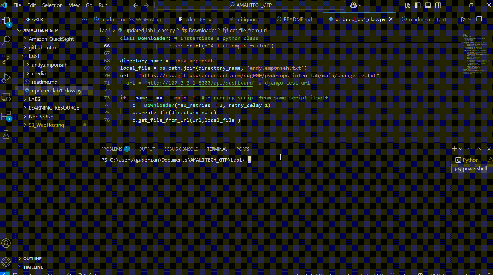

```markdown
# 🐍 Python File Downloader & Modifier Lab

This is a Python-based utility script designed to:

1. Create a specific directory.
2. Download a file from a remote URL.
3. Prompt the user to describe what they’ve learned.
4. Overwrite the downloaded file with the user's input and timestamp it.
5. Display the updated file contents.

This project demonstrates fundamental Python concepts including HTTP requests, file handling, error handling, directory operations, and basic input/output workflows.


## 📸 Demo




## 🚀 How It Works

1. The script **creates a new directory** (or deletes and recreates it if it already exists).
2. **Downloads a `.txt` file** from a predefined URL.
3. **Prompts the user** for a reflective input sentence.
4. **Overwrites the downloaded file** with that input and a timestamp.
5. **Reads and displays** the updated file content in the terminal.

---

## 🧰 Technologies Used

- Python 3.x
- `requests` module
- Standard libraries: `os`, `sys`, `shutil`, `datetime`, `time`

---

## 📁 File Structure

```
andy.amponsah/
├── andy.amponsah.txt  # File downloaded and later overwritten
```

---

## ⚙️ Running the Script

### Prerequisites:
- Python 3.x installed
- `requests` library (install using `pip install requests`)

### To Run:
```bash
python your_script_name.py
```

Replace `your_script_name.py` with the name of your Python file.

---

## ❗ Notes

- The file is downloaded from:  
  `https://raw.githubusercontent.com/sdg000/pydevops_intro_lab/main/change_me.txt`
- The directory and file names are hardcoded as `andy.amponsah/andy.amponsah.txt`.
- Retry logic is built in for the file download (3 attempts by default).
- The script will overwrite the downloaded content with your input and a timestamp.

---

## 📚 Learning Outcomes

This lab exercise helps build confidence with:

- Writing reusable classes and methods in Python.
- Handling real-world HTTP requests and file I/O.
- Building robust, user-interactive command-line tools.

---

## 🧑‍💻 Author

Andy Amponsah  
Lab for Intro to Python DevOps

---

## 📝 License

This project is for educational use and demonstration purposes.
```
